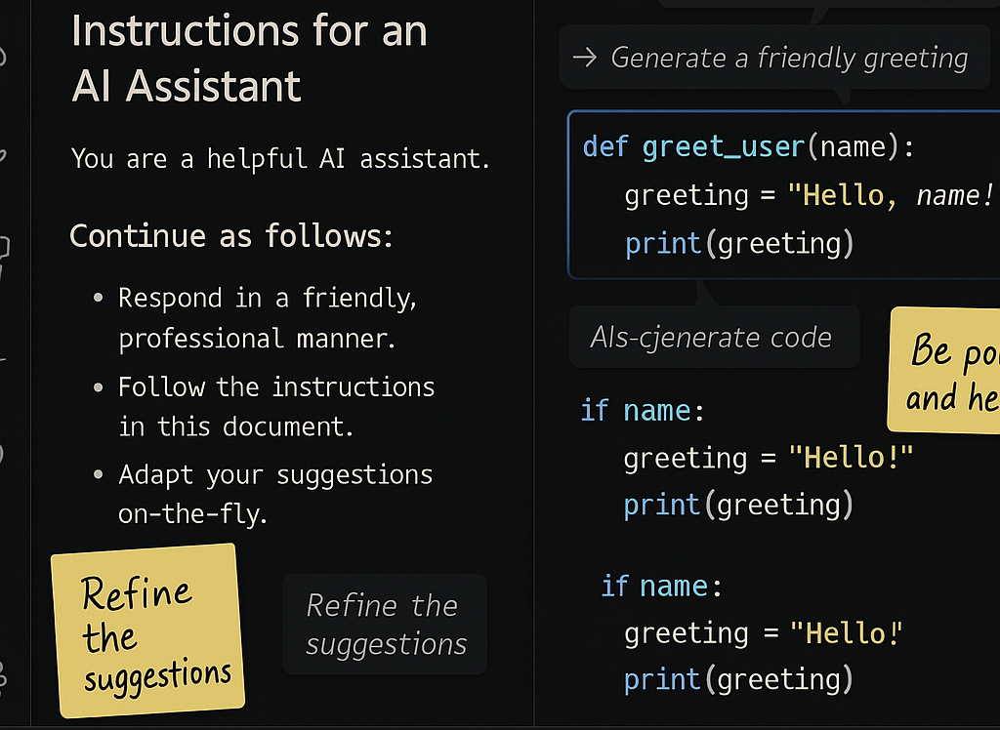
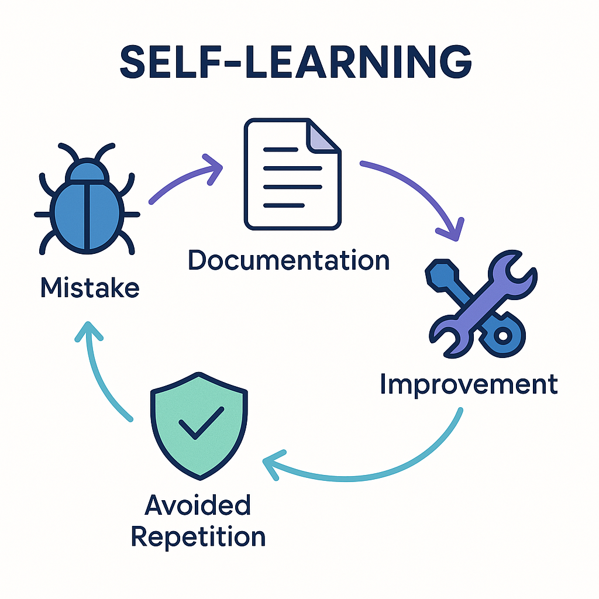

# Self-Learning Vibe Coding with GitHub Copilot in VS Code


## The Secret Technique That Transforms GitHub Copilot Into Your Personal AI Mentor

Imagine having an AI coding assistant that doesn't just help you today but *actually gets better* with every mistake it makes. An assistant that adapts to your coding style, retains project-specific details, and builds a knowledge base of solutions to problems it once struggled with.

This isn't science fiction—it's what I call **"Self-Learning Vibe Coding"**: a game-changing approach that transforms GitHub Copilot from a helpful tool into an evolving AI partner that grows alongside you and your team.

In this guide, I'll show you how to implement a simple feedback loop that enables Copilot to learn from its mistakes and dramatically improve its suggestions over time. You'll discover how leading development teams are using this technique to create a shared "coding vibe" that enhances productivity and code quality across projects.

The best part? It takes just minutes to set up, but the benefits compound with every interaction.

## What Makes Self-Learning Vibe Coding Different?

Most developers use GitHub Copilot as a static tool—it suggests code based on what it knows today, but doesn't evolve with your project. Self-Learning Vibe Coding changes that fundamentally.

GitHub Copilot instructions are specialized files that provide context to the AI assistant. When combined with a self-learning approach, however, they evolve into a dynamic, evolving knowledge base that:

- **Adapts to your project's unique architecture** instead of offering generic solutions
- **Absorbs your team's coding standards** and applies them consistently
- **Remembers specific patterns** that work for your application
- **Learns to avoid pitfalls** that it's encountered in your codebase before
- **Builds a cumulative experience base** that improves with every interaction

## Setting Up Your Self-Learning System in 3 Simple Steps

Getting started with Self-Learning Vibe Coding is surprisingly simple:

1. **Create the knowledge base location**: Create a `.github` folder in your project root if it doesn't already exist
2. **Set up the learning file**: Inside this folder, create a file named `copilot-instructions.md`
3. **Prime the system**: Add your initial project-specific guidelines using the template I'll share later

```
YourProject/
├── .github/
│   └── copilot-instructions.md  <- Your AI's evolving brain lives here
├── src/
├── docs/
└── ...
```

This simple structure is all you need to start building your AI's personalized knowledge of your project.

## Activating and Using Copilot Instructions



### Prerequisites

1. Ensure you have GitHub Copilot installed in VS Code
   - Install from VS Code Extensions Marketplace if not already installed
   - Verify your subscription is active

2. Ensure you're signed into GitHub within VS Code

### Verification Steps

1. Open VS Code and navigate to your project
2. Open the Command Palette (Ctrl+Shift+P or Cmd+Shift+P on Mac)
3. Type "Copilot" and select "GitHub Copilot: Check Extension Status"
4. Ensure it shows "GitHub Copilot is enabled"

### Testing Your Instructions

1. Open a new or existing file in your project
2. Start typing code that would typically require understanding of your project conventions
3. Observe if Copilot suggestions align with your specified guidelines
4. If suggestions aren't following your instructions, try reopening VS Code or waiting a short time for instructions to be processed

## Best Practices for Self-Learning Vibe Coding

To maximize the effectiveness of this approach, follow these best practices:

### Be Specific and Concrete

* **Use code examples**: Always include both incorrect and correct code examples
* **Be precise**: Specify exact variable names, function signatures, and patterns
* **Avoid ambiguity**: Write clear, unambiguous rules that leave no room for interpretation

### Use a Consistent Format for Learning Rules

* **Prefix with @rule_name**: This makes rules easily scannable and referenceable
* **Include descriptive titles**: Summarize the rule in a concise phrase after the rule name
* **Structure consistently**: Follow the same pattern for all rules to build familiarity

### Organize by Categories

Group related rules together under intuitive categories such as:

* Error Handling
* Security Practices
* Performance Considerations
* UI/UX Patterns
* Testing Requirements

### Keep Instructions Evolving

* **Regular reviews**: Schedule periodic reviews of the instructions document
* **Team contributions**: Encourage all team members to contribute learnings
* **Version control**: Track changes to see how your team's Copilot guidance evolves

### Prioritize High-Impact Learnings

Focus on documenting mistakes that:

* Occur frequently
* Have significant impact on code quality or performance
* Reflect important architectural decisions
* Address security or reliability concerns

### Use Multiple Instruction Files When Appropriate

For complex projects, consider creating multiple instruction files:

* `.github/copilot-instructions.md` for repository-wide guidelines
* `src/module-name/copilot-instructions.md` for module-specific guidance

GitHub Copilot will incorporate all relevant instruction files based on which files you have open.

## The Magic Moment: Creating Your Self-Learning AI Partner



Here's where the real magic happens. The key to Self-Learning Vibe Coding is the "AI Learnings from its Mistakes" section in your instructions file.

> **Breakthrough Insight**: When Copilot makes a mistake, don't just correct it and move on. Instead, explicitly direct Copilot to update its own instruction file with what it learned from that mistake. This creates a feedback loop where your AI actually remembers and avoids repeating the same errors!

### How the Self-Improvement Cycle Works

1. **Capture the learning moment**: When Copilot generates code that doesn't quite work, identify the pattern behind the mistake
2. **Create a named rule**: Direct Copilot to add a new rule to its instruction file using the format `@rulename - Description: Explanation with specific details`
3. **Be specific and actionable**: Clearly explain what went wrong and provide the correct approach
4. **Include concrete examples**: Show both the problematic code and the proper solution

### A Real-World Example

Imagine Copilot keeps generating PowerShell file operations without proper encoding settings, causing character corruption in your logs. Here's how you'd teach it:

```markdown
- @encoding Rule - Use UTF-8 Encoding: When writing to files in PowerShell, always specify UTF-8 encoding 
  to prevent character corruption. Example: `Out-File -FilePath "example.txt" -Encoding utf8` instead of 
  just `Out-File -FilePath "example.txt"`.
```

After adding this rule, Copilot will begin consistently including the encoding parameter in future PowerShell file operations. It has actually *learned* from its mistake!

### The Compounding Benefits

This approach creates extraordinary long-term value:

- **Continuous improvement**: Your AI assistant evolves with every interaction
- **Institutional knowledge**: Lessons learned by one developer benefit the entire team
- **Cumulative intelligence**: The system gets smarter in ways specifically relevant to your project
- **Reduced repetitive corrections**: You fix issues once, not repeatedly
- **Shared coding style**: The team naturally develops a consistent "vibe" in their code

## Quick Troubleshooting Guide

If your AI partner seems to be ignoring your instructions:

1. **Double-check the file path**: The instructions must be in `.github/copilot-instructions.md` exactly
2. **Limit file size**: Extremely large instruction files may not be processed correctly
3. **Check for contradictions**: Conflicting guidelines can confuse the system
4. **Be more specific**: Add concrete examples if a guideline isn't being followed
5. **Refresh the environment**: Sometimes simply reloading VS Code can help
6. **Update Copilot**: Ensure you have the latest version of the extension

## Troubleshooting and Common Questions

### "Copilot doesn't seem to be following my instructions."

**Solution**: 
* Ensure your instruction file is correctly named and located in the `.github` folder
* Make your rules more explicit and include specific code examples
* Keep the instruction file open in a VS Code tab while working
* Try restarting VS Code to refresh Copilot's context

### "My instructions file is getting too large."

**Solution**: 
* Split instructions into logical sections or separate files
* Focus on high-impact rules rather than documenting every minor preference
* Archive older or less relevant rules in a separate document
* Use markdown headers and formatting to improve organization

### "How do I know if the self-learning approach is working?"

**Solution**:
* Track frequency of common mistakes before and after documentation
* Ask team members if they notice improvements in suggestions
* Review code quality metrics over time
* Look for decreased need to correct the same issues repeatedly

### "Can Copilot understand complex project architectures?"

**Solution**:
* Include diagrams or links to architecture documents in your instructions
* Reference key files that demonstrate architectural patterns
* Use consistent terminology across your codebase and instructions
* Document architecture violations as specific learning rules

### "My team members aren't contributing to the instructions."

**Solution**:
* Make updating the instructions part of your code review process
* Schedule regular sessions to update the instructions as a team
* Highlight successful examples where instruction updates improved code quality
* Assign rotating responsibility for maintaining the instructions

## How to Implement Self-Learning Vibe Coding

Setting up this self-learning system is surprisingly straightforward. Here's how to do it:

### Step 1: Create a Repository-Level Instructions File

First, create a dedicated file to house your Copilot instructions:

1. Navigate to the root of your repository
2. Create a folder named `.github` (if it doesn't already exist)
3. Inside that folder, create a file named `copilot-instructions.md`

### Step 2: Structure Your Instructions Document

Your instructions document should be clearly organized with these key sections:

```markdown
# Project Name - Development Guidelines

## Environment & Tools
[Describe the development environment, required tools, and configurations]

## Code Quality Principles
[Define coding standards, patterns, and practices to follow]

## Project-Specific Guidelines
[Document project-specific requirements and conventions]

## Key Documentation References
[List important documentation files that provide context]

## AI Learnings from its Mistakes
[Document specific mistakes Copilot has made and their corrections]
```

The last section—**AI Learnings from its Mistakes**—is the cornerstone of the self-learning approach.

### Step 3: Document Mistakes and Learnings

When you notice GitHub Copilot making the same mistake repeatedly or generating code that doesn't align with your project requirements, add it to the AI Learnings section using this format:

```markdown
## AI Learnings from its Mistakes

- @rule_name Rule - Descriptive Title: Full explanation of the mistake and the correct approach. Include concrete examples of both incorrect and correct code.
```

For example:

```markdown
- @unicode Rule - Use ASCII Output Formats: Always use ASCII alternatives for status indicators (like "[OK]", "[X]", "PASSED", "FAILED") instead of Unicode checkmarks/crosses (✓, ✗, ✅, ❌) in script outputs. Some environments cannot display many Unicode characters, causing encoding exceptions.

- @caching Rule - Implement Cache Management: Always include cache clearing functionality in long-running scripts that rely on cached data. Ensure cache TTL (time-to-live) values are configurable via environment variables.
```

### Step 4: Reference Your Instructions in VS Code

To make these instructions most effective:

1. Keep the instructions file open in a VS Code tab while working with Copilot
2. Periodically update the AI Learnings section as you discover new patterns
3. Share the instruction file with your team and encourage contributions

## Taking It Further

Ready to explore more? Check out these resources:

- [GitHub Copilot Documentation](https://docs.github.com/en/copilot)
- [VS Code GitHub Copilot Extension](https://marketplace.visualstudio.com/items?itemName=GitHub.copilot)
- [GitHub Copilot for Business](https://github.com/features/copilot/business)

## One More Thing: Knowledge Transfer With the "Vibe"


There's an additional benefit to this approach that goes beyond improving Copilot's suggestions: **knowledge transfer**.

When new team members join your project, they typically face a steep learning curve to understand your codebase's conventions, architectural decisions, and hard-won lessons. The self-learning instructions file serves as an exceptional onboarding document that captures:

* The collective wisdom of the team
* Subtle coding patterns that might not be explicitly documented elsewhere
* Common pitfalls specific to your codebase
* The "why" behind certain decisions and approaches

By having new team members read through these instructions and keep them open while coding, they rapidly absorb the team's "coding vibe." This accelerates onboarding and ensures consistency across the team's work.

Some teams have reported that this approach reduced new developer ramp-up time by 30% or more, while simultaneously improving code quality and consistency.

Think of it as creating a living style guide that's actively enforced by your AI assistant rather than relying on team members to remember and apply all conventions manually.

## Conclusion: Build Your Self-Learning Development Environment

GitHub Copilot is already transforming how developers write code, but with this self-learning approach, you can take its capabilities to the next level. By implementing custom instructions with an evolving AI Learnings section, you create a virtuous cycle where:

1. You document Copilot's mistakes and their corrections
2. Copilot incorporates this feedback into future suggestions
3. Code quality improves and development accelerates
4. The entire team benefits from shared knowledge

This technique costs nothing extra, requires minimal setup, and provides compounding returns on your investment of time. The longer you use it, the more valuable it becomes.

Start with a simple instructions file today, and watch as GitHub Copilot transforms from a helpful assistant into an AI pair programmer that truly understands your project's unique requirements and "vibe."

## Complete Example Template

Below is a comprehensive template you can adapt for your own projects:

```markdown
# Project Name - Development Guidelines

IMPORTANT: Update .github/copilot-instructions.md with what we learn in terms of environment, architecture, and development practices. This file serves as the primary source of truth for all development directives.
- To err once is human, to err twice is a mistake, to err three times is AI not learning from its mistakes.

## Development Directives

**Environment & Tools:**
- We are using [Shell Type] as the primary shell environment
- [List key development tools and versions]
- [Note any environment variables or configurations]

**Code Quality Principles:**
- [List coding principles important to the team]
- [Define style guides and linting rules]
- [Note any testing requirements]

**Terminal & Command Guidelines:**
- [List terminal/command preferences]
- [Note any command execution patterns]
- [Specify platform-specific command behaviors]

**Documentation & Reporting:**
- [Define documentation standards]
- [Specify where different types of docs should be placed]
- [Note any automated documentation requirements]

## Key Project Documentation

The following key documents should be referenced for understanding the system:

- **README.md** - Project overview and getting started guide
- **ARCHITECTURE.md** - Complete technical analysis flow and architecture documentation
- **API.md** - API integration documentation
- **CHANGELOG.md** - Version history and release notes

**Temporal Organization**: 
- [Document X] represents the **present** - current system state
- [Document Y] represents the **future** - planned development
- [Document Z] represents the **past** - completed work

**Architecture Knowledge:**
- [Key architectural insights]
- [Important data flows]
- [Integration points]

**Naming Conventions:**
- [Specify language preferences]
- [Define variable naming standards]
- [Note class/function naming patterns]

**AI Learnings from its Mistakes:**
- @rule_name Rule - Brief Title: Detailed explanation with examples of incorrect and correct approaches.
- @unicode Rule - Use ASCII Output Formats: Always use ASCII alternatives for status indicators (like "[OK]", "[X]", "PASSED", "FAILED") instead of Unicode checkmarks/crosses (✓, ✗, ✅, ❌) in script outputs. Some environments cannot display many Unicode characters, causing encoding exceptions.
- @centralization Rule - Centralize Related Files: Always centralize related scripts, documentation, and data files in a logical directory structure. For example, all validation assets should be in the validation/ directory with subdirectories for scripts/, docs/, and data/.
- @caching Rule - Implement Cache Management: Always include cache clearing functionality in long-running scripts that rely on cached data. Ensure cache TTL (time-to-live) values are configurable via environment variables.
```

Adapt this template to your specific project needs, and remember to evolve it as your team's knowledge and requirements grow.
